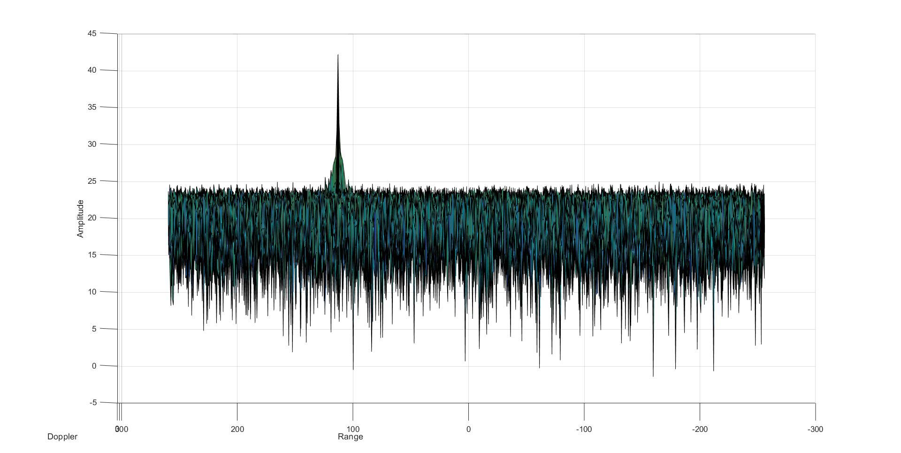
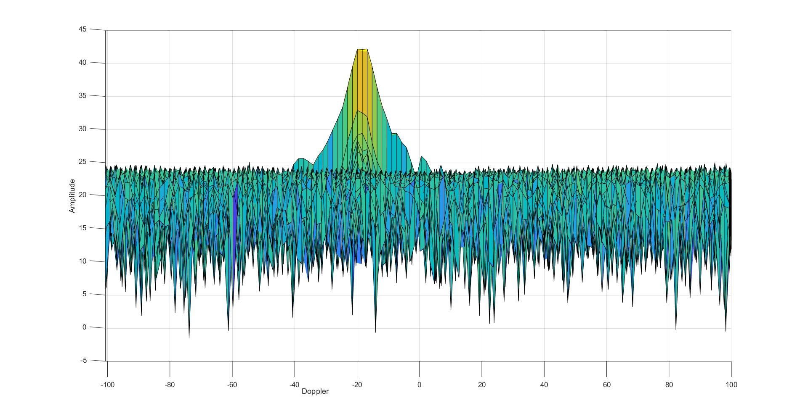
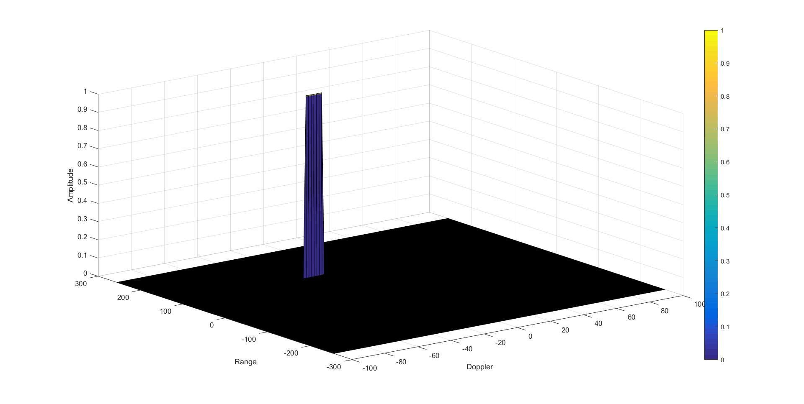

# Radar Target Generation and Detection

## Selection of Training, Guard cells and offset
Below are the image of Range-Amplitude and Doppler-Ampltiude plot. 

As we can see, the signal spread is more in Doppler axis and very less in Range axis. So to not include the signal tail in noise estimation, the number of Guard Cells should be more in Doppler axis and few sufficient Guard Cells in Range axis. Hence the numbers 3 and 6 for Guard Cells in Range and Doppler axis respectively.
For this particular exercise the noise is almost the same everywhere. So just few training cells are enough to estimate the noise and hence 2 Training Cells in each Range and Doppler axis.
Looking again at the Range-Ampltude plot above, we can see that the noise is at ~25dB and the signal peak is ~42.5dB giving a difference of ~17.5dB between noise and signal peak. So I selected the offset as 15dB.

## Implementation of 2D CFAR
Ignoring the edge cells and for easier computation, I start the loop with the cell which falls in center of the 2D matrix formed by Guard Cells and Training Cells and the 2D matrix has to completely overlap the Range-Doppler Map(RDM) matrix. Next the mean noise level is calculated by summing and averaging only the Training Cells. Special care is taken when adding the cell values as they are in dB. The values are converted to power using db2pow function. Once the average noise is calculated, the noise is converted back to dB using pow2db function. To this noise level, the offset is added to get the final threshold value. The Cell Under Test(CUT) is compared against this threshold. If the CUT is greater than the threshold, then the CUT is assigned 1 otherwise 0.

## Steps taken to suppress the non-thresholded cells at the edges
As the 2D CFAR algorithm ignores the edge cells, these cells will have some non-zero noise values. This has to be supressed to find the actual signal. This is taken care in the final stage of 2D CFAR where we compare the CUT against the threshold. If the CUT is greater than the threshold, then the CUT is assigned a huge value, in my case I chose 10000, otherwise 0. Once the CFAR algorithm is run on the entire RDM, I set all those cells which are neither 0 nor 10000 to 0. Next I assign all those cells which are equale to 10000 as 1 thereby I get only 0 or 1 in the final RDM as shown below:

