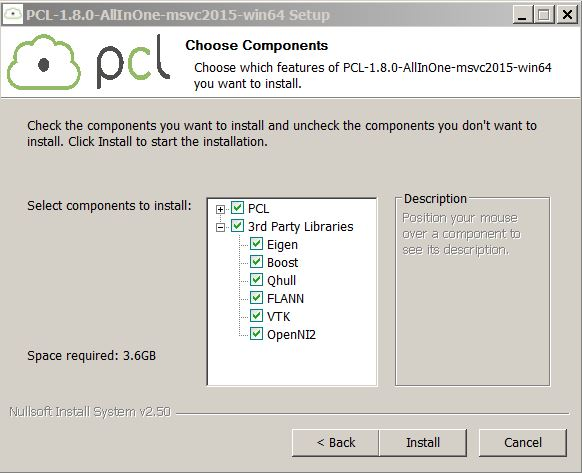

# Setting up Point Cloud Library(PCL) in Visual Studio 2015
1. Download the PCL 1.8.0 All-In-One Installer for Microsoft Visual Studio 2015 from https://1drv.ms/u/s!ApoY_0Ymu57sg5QiqO2sR1k-zcSi_w
2. Below are the third party softwares included in the installer
  
  Install the PCL-1.8.0-AllInOne-msvc2015-win64.exe.
3. Also install OpenCV and Freeglut(https://www.transmissionzero.co.uk/files/software/development/GLUT/freeglut-MSVC.zip)
4. Once installed, make sure you have the following environment variables:
... * PCL_ROOT → The install path you chose to install PCL. It should have folders like 3rdParty under Eg: C:\Program Files\PCL 1.8.0
... * OPENNI2_LIB64 → The Lib folder under the place where your OpenNI2 is installed. Eg: C:\Program Files\OpenNI2\Lib
... * OPENNI2_INCLUDE64 → The Include folder under the place where your OpenNI2 is installed. Eg: C:\Program Files\OpenNI2\Include
... * OPENNI2_REDIST64 → The Redist folder under the place where your OpenNI2 is installed. Eg: C:\Program Files\OpenNI2\Redist
... * OPENCV_DIR → Go to your opencv install/unpack directory. Navigate to build → x64 (or 32 if you opted for 32 bits) → vc14 (in case you are using VS 2015). Set the value of the environment value to this folder. Eg: C:\Project\Softwares\OpenCV\opencv\build\x64\vc14
... * FREEGLUT_DIR → Set this to the location where you installed/extracted freeGLUT. Directories like bin and include should be UNDER the pointed folder. Eg: C:\Project\Softwares\freeglut

